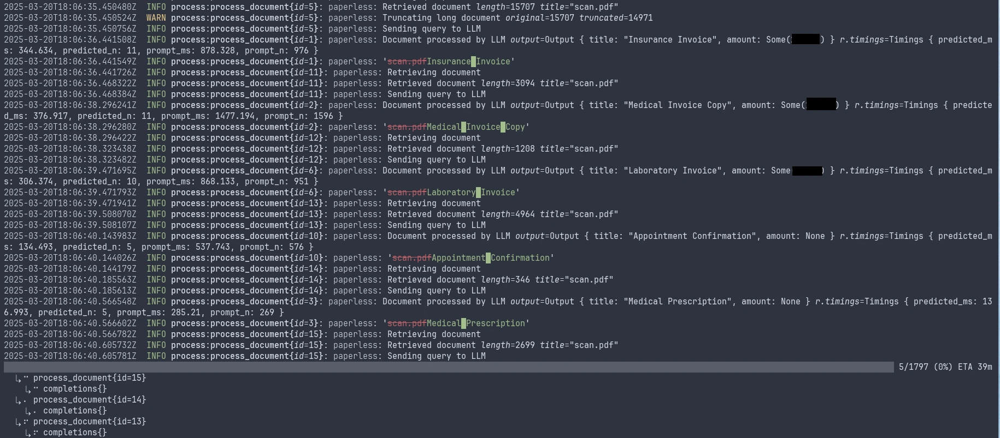

# paperless-llm

Populate [`paperless-ngx`](https://docs.paperless-ngx.com/) document metadata (for now title and monetary amount if relevant) using local LLMs.



See https://c.pgdm.ch/notes/paperless-llm/

## Installation

1. Get a model to use with `llama.cpp` e.g. Gemma3 from https://huggingface.co/unsloth/gemma-3-12b-it-GGUF. This is a good multilingual model that fits (in Q5_K_M quantization) on a RTX 3060 with 12 GB VRAM, with relatively fast processing speed (typically < 2s per document).
2. Install `llama-server` from `llama.cpp`: https://github.com/ggml-org/llama.cpp
3. Install the tool

   ```
   $ cargo install --git https://github.com/cpg314/paperless-llm
   ```

4. Create an `llm-process` tag in your `paperless-ngx` instance, and set it as "Inbox tag", so that new documents are assigned this tag.
5. Create an "Amount" custom monetary field in your `paperless-ngx` instance.

### Usage

1. Launch a `llama.cpp` server:

   ```
   $ llama-server -m gemma-3-12b-it-Q5_K_M.gguf --port 8080 -ngl 1000 -c 6000 -t 12 --batch-size 512 -fa --n-predict 100 --no-context-shift --parallel 1 --metrics --host 0.0.0.0
   ```

   This should fit on 12 GB of VRAM; adjust `-ngl` (CPU offload) if not. If you have more memory available, increase the context size (`-c`) and the parallelism (`((parallel))`).

2. Run the tool
   ```
   $ paperless-llm --paperless-url ... --paperless-token ... --openai-url http://localhost:8080/
   ```
   (update the paperless flags).
3. Add `--apply` to apply changes. This will update the titles and monetary amounts and remove the `llm-process`.

   > WARNING
   > This will overwrite previous titles and monetary amounts. Please make backups.

To process all existing documents, either add the `llm-process` tag manually, or use the `--process-all` flag.

## TODO

- Cache the LLM outputs to use `--apply` without recomputing.

## See also

- https://github.com/icereed/paperless-gpt
- https://github.com/B-urb/doclytics
- https://github.com/clusterzx/paperless-ai
